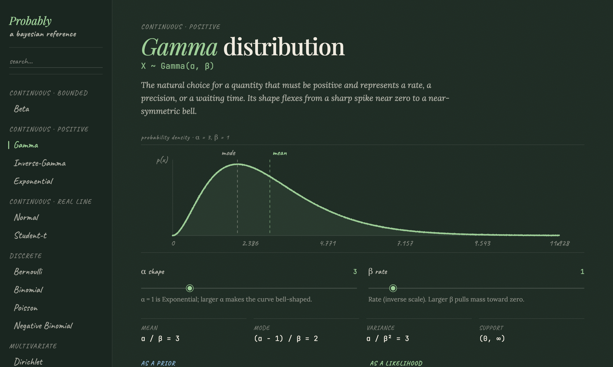

<div align="center">

# Probably

*an interactive chalkboard reference for probability distributions and Bayesian inference*

[](https://markstent.github.io/probably/)

[](https://markstent.github.io/probably/)


### → [**markstent.github.io/probably**](https://markstent.github.io/probably/) ←



</div>

## What is this?

**Probably** is a free, interactive reference for the probability distributions that turn up in Bayesian statistics. Pick a distribution and you get one clean board that answers the questions you actually have: what is this distribution, what does it look like, when would I use it, and how does it update when I see data.

It is designed for students, data scientists, and anyone building Bayesian models who wants to build intuition rather than dig through scattered textbook pages and inconsistent notation. No sign-up, no installation, nothing to download. Just open the link.

Above all it is meant to be a **reference point for Bayesian modelling**: a quick place to refresh your memory when you are mid-model and need to recall which prior to reach for, what a parameter controls, or how a conjugate update works, without breaking your flow.

## What you get for each distribution

- **Notation and a plain-language tagline** so you know immediately what it is for.
- **An interactive curve.** Drag the parameter sliders and watch the density redraw live, so you can feel how each parameter changes the shape. Discrete distributions are drawn as bar charts; the Dirichlet is drawn on its simplex.
- **Live summary statistics** (mean, mode, variance, and support) that update as you move the sliders.
- **"As a prior" and "as a likelihood" guidance** in point form: when to reach for it, what the parameters mean in practice, how to choose them, and the common pitfalls. Where a distribution is not really used in one of those roles, it says so honestly and tells you what to use instead.
- **The conjugate update written out in full** (prior × likelihood → posterior), with the equations and a plain-English explanation of what the update is doing. Where there is no tidy update, it explains which sampler to use and why.
- **Concrete worked examples** with real domains and numbers.
- **Links to related distributions** so you can explore the family.

## Distributions covered

| Family | Distributions |
| --- | --- |
| Continuous · bounded | Beta |
| Continuous · positive | Gamma, Inverse-Gamma, Exponential |
| Continuous · real line | Normal, Student-t |
| Discrete | Bernoulli, Binomial, Poisson, Negative Binomial |
| Multivariate | Dirichlet |

More distributions are on the way; the site is built so each new one slots straight in.

## Getting around

- **Search** the sidebar to filter the list, and press **Enter** to jump to the first match.
- **↑ / ↓ arrow keys** move between distributions.
- **Esc** or clicking the **Probably** logo returns you home.
- Every page has its own link (for example [`#gamma`](https://markstent.github.io/probably/#gamma)), so you can bookmark or share a specific distribution.
- It works on phones and tablets as well as desktop.

## Good to know

- Everything runs in your browser. No data is collected, no cookies are set, and nothing is sent anywhere.
- The mathematics (densities, summary statistics, and conjugate updates) is computed in the browser and is covered by an automated test suite that checks each density integrates to one and that its stated mean and variance are correct.

---

<details>
<summary><b>For developers and contributors</b></summary>

Probably is a static site: plain HTML, CSS, and vanilla JavaScript with no build step. Each distribution is one self-contained ES module in `js/distributions/`.

**Run it locally** (native ES modules need HTTP, so opening the file directly will not work):

```bash
python3 -m http.server 8000   # then open http://127.0.0.1:8000
```

**Run the tests:**

```bash
npm install
npm test             # numeric checks on every distribution module
npm run test:smoke   # Playwright tests for rendering and routing
```

**Add a distribution:** create a module in `js/distributions/` exporting a single object (`pdf`/`pmf`, `xRange`, `stats`, `prior`, `likelihood`, `conjugate`, `examples`, `related`), then add it to `js/registry.js`. The sidebar, home grid, routing, and related-chip filtering all derive from that list. `pdf`/`pmf`, `xRange`, and `stats` are pure functions so they can be tested headlessly.

**Deploy:** push to `main`; GitHub Pages serves the repository root (a `.nojekyll` file is included).

</details>
